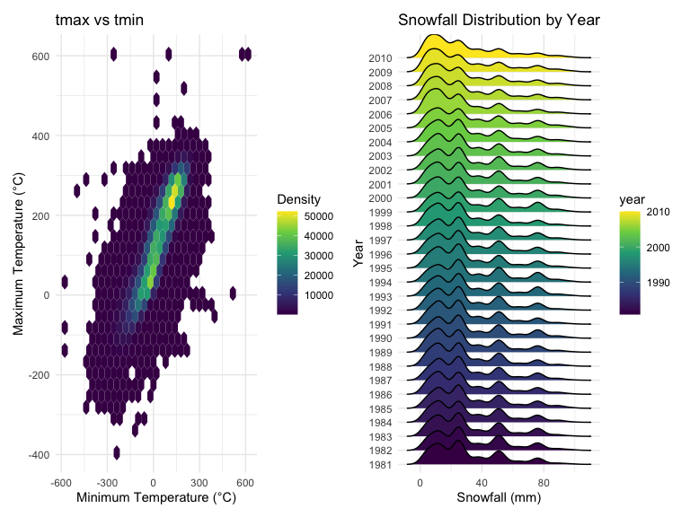

p8105_hw3_rd3096
================

# load necessary pakages

``` r
library(tidyverse)
```

    ## ── Attaching core tidyverse packages ──────────────────────── tidyverse 2.0.0 ──
    ## ✔ dplyr     1.1.4     ✔ readr     2.1.5
    ## ✔ forcats   1.0.0     ✔ stringr   1.5.1
    ## ✔ ggplot2   3.5.1     ✔ tibble    3.2.1
    ## ✔ lubridate 1.9.3     ✔ tidyr     1.3.1
    ## ✔ purrr     1.0.2     
    ## ── Conflicts ────────────────────────────────────────── tidyverse_conflicts() ──
    ## ✖ dplyr::filter() masks stats::filter()
    ## ✖ dplyr::lag()    masks stats::lag()
    ## ℹ Use the conflicted package (<http://conflicted.r-lib.org/>) to force all conflicts to become errors

``` r
library(ggridges)
library(patchwork)
library(ggplot2)

library(p8105.datasets)
data("ny_noaa")

knitr::opts_chunk$set(
    echo = TRUE,
    warning = FALSE,
    fig.width = 8, 
  fig.height = 6,
  out.width = "90%"
)

theme_set(theme_minimal() + theme(legend.position = "bottom"))

options(
  ggplot2.continuous.colour = "viridis",
  ggplot2.continuous.fill = "viridis"
)

scale_colour_discrete = scale_colour_viridis_d
scale_fill_discrete = scale_fill_viridis_d
```

## problem 1

### read and explore the dataset “ny_noaa”

we explore the dataset and get a summary of the dataset

``` r
data("ny_noaa")
```

### we write a short description of the dataset and answer the following questions

Our dataset ahs 2595176 rows and 7 columns.It includes key variables
such as id (station identifier), date, prcp (precipitation), snow
(snowfall), snwd (snow depth), tmax (maximum temperature), and tmin
(minimum temperature).” The variable types based on our output are
listed as follows:

- id: character

- date: Date format

- prcp, snow, snwd: integer

- tmax, tmin: character (we wil convert these into numeric later for
  proper analysis).

Missing data is a significant issue in the ny_noaa dataset, especially
for snow depth (snwd) and snowfall (snow), Precipitation has less
missing data, but it still affects a non-negligible portion of the
dataset.

we will do some data cleaning for subquestion 1

``` r
ny_noaa_cleaned = 
  ny_noaa %>%
  separate(date, into = c("year", "month", "day"), convert = TRUE) %>%
  mutate(
    tmax = as.numeric(tmax),    
    tmin = as.numeric(tmin)               
  )

ny_noaa_cleaned %>%
  group_by(snow) %>%
  summarize(count = n()) %>%
  arrange(desc(count))
```

    ## # A tibble: 282 × 2
    ##     snow   count
    ##    <int>   <int>
    ##  1     0 2008508
    ##  2    NA  381221
    ##  3    25   31022
    ##  4    13   23095
    ##  5    51   18274
    ##  6    76   10173
    ##  7     8    9962
    ##  8     5    9748
    ##  9    38    9197
    ## 10     3    8790
    ## # ℹ 272 more rows

After we cleaned our dataset, CONVERT the variables into numeric and
count the number of observed values, we found out:

1.  0 mm of snowfall is the most frequently observed value, with
    2,008,508 instances. This is because many days throughout the year
    do not experience snowfall, especially during non-winter months and
    in areas where snow is rare.

2.  There are 381,221 missing values (NA) in the dataset for snowfall.
    These might correspond to missing data for days or locations where
    snowfall was not recorded.

3.  Other common values include 25 mm, 13 mm, and 51 mm of snowfall,
    which likely represent light to moderate snowfall amounts. These
    values are typical during days when snow does occur, especially in
    regions that experience winter weather regularly.

we will make a two-panel plot for subquestion2

``` r
  ny_noaa_cleaned %>% 
  filter(month %in% c(1, 7)) %>% 
  group_by(id, year, month) %>% 
  summarize(avg_tmax = mean(tmax, na.rm = TRUE), .groups = 'drop') %>% 
  ggplot(aes(x = year, y = avg_tmax, color = id)) +
  geom_point()+
  geom_line()+
  facet_grid(. ~ month)+
  labs(
      title = "Mean Monthly Temperature for Each Station Across Years (January and July)",
    x = "Year",
    y = "Mean Max Temperature (°C)",
    color = "Station"
  ) +
theme(legend.position = "none")
```


The mean temperature in January is significantly lower than the mean
temperature in July across all stations and years. The stations show
consistent patterns of temperature fluctuations over time, with peaks
and valleys within each month. When one station exhibits a higher
monthly mean temperature in a given year, most other stations tend to
follow a similar pattern, indicating a general trend across regions.
However, there is an observable anomaly between 1980 and 1990, where one
station recorded an unusually cold temperature compared to others.

we will make a two-panel plot for subquestion3

``` r
tmax_tmin_p = 
  ny_noaa_cleaned %>%
  filter(!is.na(tmax), !is.na(tmin)) %>%  # Ensure there are no missing values
  ggplot(aes(x = tmin, y = tmax)) +
  geom_hex() +  # Use hexbin to show density of points
  scale_fill_viridis_c() +  # Use a continuous color scale
  labs(
    title = "tmax vs tmin",
    x = "Minimum Temperature (°C)",
    y = "Maximum Temperature (°C)",
    fill = "Density"
  ) +
  theme_minimal()


ny_noaa_ridge=
  ny_noaa_cleaned %>%
  filter(snow > 0 & snow < 100, !is.na(snow)) %>%  # Filter snowfall values
  ggplot(aes(x = snow, y = as.factor(year), fill = year)) +  # Treat year as a factor
  geom_density_ridges() +  # Create density ridges
  labs(
    title = "Snowfall Distribution by Year",
    x = "Snowfall (mm)",
    y = "Year"
  ) +
  theme_minimal()

tmax_tmin_p+ny_noaa_ridge
```

    ## Picking joint bandwidth of 3.76


\* The tmax vs tmin plot reveals a strong linear relationship between
maximum and minimum temperatures, but also highlights several extreme
outliers that need further investigation. These unrealistic values
likely reflect data quality issues.

- The snowfall distribution plot shows that snowfall values are fairly
  consistent across the years, with some variability, especially in the
  late 2000s where higher snowfall amounts are observed. However, no
  extreme deviations are evident in the snowfall distributions, and the
  overall pattern remains relatively stable over time.

## problem 2

### read the dataset

``` r
demo= read.csv("./demo.csv", na=c("NA","","."), skip=4) 
acce = read.csv("./acce.csv",na=c("NA","","."))
```

### load, tidy and merge the datasets

we will clean the dataset and recode sex and education as factor

``` r
demo_clean=
  demo %>% 
  filter(age>=21) %>% 
  mutate(
    sex=factor(
      case_match(
        sex,
        1~"Male",
        2~"Female"
      ),
      levels=c("Male", "Female")
    ),
    education = factor(
      case_match(
        education, 
        1 ~ "Less than high school",
        2 ~ "High school equivalent",
        3 ~ "More than high school",
      ),
      levels = c("Less than high school", "High school equivalent", "More than high school")  # Set as ordered factor because education has a natural order
    )
  ) %>% 
  drop_na(sex, age, BMI, education)
```

now we have ensured that any rows with missing values in sex, age, BMI,
or education are dropped after the necessary cleaning operations are
completed. And we have recoded sex and education as factor and define
the level of each variable.

we will merge the two dataset by SEQN

``` r
merged_data=
  left_join(demo_clean, acce, by = "SEQN")
```

produce a table for the number of men and women in each education
category, and create a visualization of the age distributions for men
and women in each education category

``` r
education_sex_table=
  demo_clean %>% 
  count(sex,education) %>% 
  arrange(education) %>% 
  select(education,everything()) %>% 
  knitr::kable()

education_sex_table
```

| education              | sex    |   n |
|:-----------------------|:-------|----:|
| Less than high school  | Male   |  27 |
| Less than high school  | Female |  28 |
| High school equivalent | Male   |  35 |
| High school equivalent | Female |  23 |
| More than high school  | Male   |  56 |
| More than high school  | Female |  59 |

``` r
age_sex_plot=
  demo_clean %>% 
  ggplot(aes(x=age,fill=sex))+
  geom_density(alpha=0.5)+
  facet_grid(.~ education)+
  labs(
    title = "Age Distributions for Men and Women by Education Level",
    x = "Age",
    y = "Density",
    fill = "Sex"
  ) +
  theme_minimal()

age_sex_plot
```


For our number of men and women in each education table:

- The table shows the number of men and women in each education
  category.

\*Less than high school: There are 27 males and 28 females, indicating a
nearly equal distribution between men and women.

\*High school equivalent: The count of men is higher (35) compared to
women (23), suggesting a higher representation of males in this
category.

\*More than high school: Females slightly outnumber males, with 59
females and 56 males. This shows a relatively balanced representation
but with a slight female dominance in the “more than high school” group.

Comment on the age distribution plot: \* Less than high school: Men and
women have similar age distributions, but men show a more distinct peak
around ages 50-60, while women have a smoother distribution.

- High school equivalent: Men and women have similar age distributions,
  with a slight difference in their peaks. Men show a more varied age
  distribution, and the distributions overlap more.

- More than high school: there is a prominent peak for women in the
  20–40 age range, indicating that a higher proportion of women in this
  category are concentrated in this younger age group. This peak is more
  pronounced than for men in the same category, who have a broader
  distribution over the age range, with a smaller peak in the same age
  group.

``` r
total_activity_new = 
  merged_data %>%
  pivot_longer(
    cols = starts_with("min"), # Select minute columns
    names_to = "minute", 
    values_to = "activity"
  ) %>%
  group_by(SEQN, sex, age, education) %>% # Group by SEQN and other demographic variables
  summarize(total_activity = sum(activity, na.rm = TRUE)) %>%
  ungroup() # Ungroup after summarizing
```

    ## `summarise()` has grouped output by 'SEQN', 'sex', 'age'. You can override
    ## using the `.groups` argument.

``` r
activity_age_plot=
  total_activity_new %>% 
  ggplot(aes(x=age, y=total_activity, color= sex)) +
  geom_point(alpha=0.5)+
  geom_smooth(se=FALSE)+
  facet_grid(.~ education)+
  labs(
    title = "Total Activity vs Age by Sex and Education Level",
    x = "Age",
    y = "Total Activity",
    color = "Sex"
  ) +
  theme_minimal() 
  
activity_age_plot
```

    ## `geom_smooth()` using method = 'loess' and formula = 'y ~ x'


Based on the three plots we created: In all education levels, women tend
to have slightly higher total activity levels compared to men,
especially in younger age ranges (20–40). However, this gap narrows as
participants age.Physical activity declines with age in both men and
women across all education levels.Higher education seems to be
associated with more stable activity levels over the lifespan,
particularly for women.Women tend to have higher total activity levels
compared to men in younger ages, but this difference diminishes in older
age.
